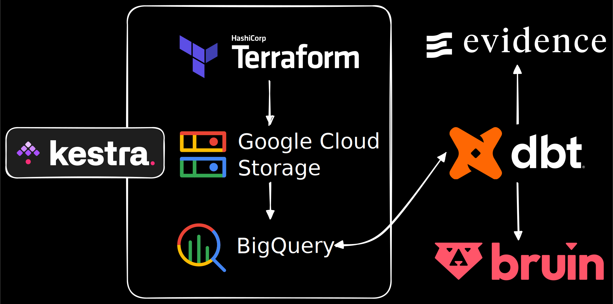

# AI Economic Index

AI development has been super crazy these days. Its use cases span everything from creating and analyzing documents, images, and videos, one-shotting complex apps, [autonomous research assistants that can draft papers and design simulations](https://www.anthropic.com/research/vibe-physics), debugging code, [discovering vital security vulnerabilities](https://www.lesswrong.com/posts/7aJwgbMEiKq5egQbd/ai-found-12-of-12-openssl-zero-days-while-curl-cancelled-its), and even orchestrating entire workflows across industries.

But is that really true: is AI disrupting job security in practice?

This repository implements the end-to-end data pipeline behind the **AI Economic Index** project: from raw Anthropic dataset ingestion to warehouse transformation (dbt), analytics outputs, and finally reporting via Evidence and Bruin.

## Important Links

- Dashboard: <https://gofhilman.github.io/ai-economic-index/>
- AI Economic Index with Bruin (Discord): <https://discord.gg/N4RBw6nkwE>
- Data analysis report: <https://stacked-stories.pages.dev/ai-economic-index-reports-13>
- Project narrative technical explanation: <https://stacked-stories.pages.dev/ai-economic-index-pipelines-12>
- Anthropic Economic Index raw dataset: <https://huggingface.co/datasets/Anthropic/EconomicIndex>

## TL;DR (What this repo does)

1. **Orchestrates** an ELT workflow in **Kestra** (Docker).
2. **Loads** Anthropic Economic Index raw releases into **BigQuery** (landing as `raw_dataset`), using **GCS** as the staging/data-lake layer.
3. **Clusters** selected releases into a more analysis-friendly **BigQuery** table (as `clustered_dataset`).
4. **Loads external enrichment datasets** (population, GDP, O*NET task statements, SOC structure) into `external_dataset`.
5. **Transforms** everything with **dbt** into an enriched analytics layer and reporting marts in BigQuery (as `output_dataset`).
6. **Builds a static dashboard** with **Evidence** directly from the marts.
7. **Creates Bruin assets** (BQ SQL assets) so an AI data analyst can query the reporting outputs programmatically.

## Architecture Overview

### High-level data flow (ELT)



The pipeline is designed as **ELT** so that compute-heavy transformations happen in the warehouse.

1. **Extract**: Download Anthropic Economic Index CSV releases from Hugging Face.
2. **Load**: Upload CSVs to a GCS bucket and load them into BigQuery datasets.
3. **Transform**: Run dbt models to normalize geography, enrich with external data, compute index/percentage metrics, derive autonomy/automation/augmentation metrics, and generate reporting marts.
4. **Report**: Evidence queries build a dashboard from the marts. Bruin exposes curated tables for interactive Q&A.

## Kestra (Orchestration + Ingestion)

Kestra is run via Docker Compose. The workflow definitions live in `kestra/flows/`.

### Local Kestra (Docker)

The container is configured to serve the UI on `http://localhost:8080/` and uses a local Postgres for Kestra’s own metadata.

### Main flows (in execution order)

All flows share the same Kestra namespace: `ai_economic_index`.

#### 1) `gc_kv` (KV setup)

Sets required runtime values in Kestra’s KV store (BigQuery project, GCS bucket/dataset names, location/zone).

Key values include:

- `GC_PROJECT_ID`
- `GC_LOCATION` / `GC_ZONE`
- `GC_BUCKET_NAME`
- `GC_RAW_DATASET` (landing schema: `raw_dataset`)
- `GC_CLUSTERED_DATASET` (schema: `clustered_dataset`)
- `GC_EXTERNAL_DATASET` (schema: `external_dataset`)

#### 2) `gc_terraform` (create the GCS bucket)

Runs Terraform CLI inside the Kestra container.

In this repo, the flow injects Terraform configuration inline (creates a single `google_storage_bucket`).

It expects the GCP service account credentials to be available as a Kestra secret named `GC_SERVICE_ACCOUNT`.

#### 3) `gc_extract_load` (Anthropic Economic Index -> GCS -> BigQuery)

Downloads the configured CSVs from:

- `https://huggingface.co/datasets/Anthropic/EconomicIndex/...`

Then, for each file:

- uploads to `gs://{GC_BUCKET_NAME}/{filename}`
- loads into BigQuery table(s) under `GC_RAW_DATASET` (schema `raw_dataset`)

#### 4) `bq_clustering` (BigQuery table clustering)

Creates a clustered table in `clustered_dataset` from the corresponding raw table:

- `CLUSTER BY geography, geo_id, facet, variable`

#### 5) `gc_external_data` (external enrichment datasets)

Creates BigQuery dataset `external_dataset` and loads enrichment files from `kestra/external-data/`.

It runs a Python loader:

- `kestra/scripts/process_external_data.py`

Supported file formats:

- `.csv` (comma delimiter)
- `.txt` (pipe delimiter)

The script also includes explicit schema overrides for cases where autodetect is unreliable (for example, ISO code tables).

## dbt (Warehouse Transformations)

dbt models live in `dbt/models/`.

This repo’s dbt project config (`dbt/dbt_project.yml`) uses a 3-layer model organization:

- **staging**: cleans/standardizes raw + external inputs (materialized as `view`)
- **intermediate**: applies business logic, geography normalization, joins, and derived metrics (materialized as `table`)
- **marts**: curated reporting tables for downstream consumption (materialized as `table`)

### BigQuery output location

The resulting dbt relations are written into BigQuery using the `output_dataset` dataset.

Evidence and Bruin assets query tables like:

- `ai-economic-index.output_dataset.mart_...`

You must have a working `dbt` BigQuery profile that points to:

- BigQuery project: `ai-economic-index`
- Output dataset: `output_dataset`
- Location: `asia-southeast2` (matching the rest of the pipeline)

## Evidence (Static Dashboard)

The reporting dashboard is built with Evidence and lives in `reports/`.

Evidence uses `reports/sources/bq/*` SQL files as the source of truth at build time, and reads marts from BigQuery.

### Build / run locally

From `reports/`:

```bash
npm install
npm run sources
npm run dev
```

`npm run dev` starts a local server and opens the dashboard.

For a static build:

```bash
npm run build
```

GitHub Pages deployment is handled by `.github/workflows/deploy.yml`.

## Bruin (AI Data Analyst Data Access)

Bruin assets live in `bruin/` and are designed to expose curated tables for a conversational AI layer.

The Bruin pipeline config is `bruin/pipeline.yml`, and default connections are configured in the repo root `.bruin.yml`.

Bruin SQL assets are defined in:

- `bruin/assets/intermediate/`
- `bruin/assets/marts/`
- `bruin/assets/reporting/`

These assets materialize BQ tables in the same `output_dataset` dataset (for example, `output_dataset.bruin_aei_work_soc_outcomes`).

### Run locally (optional)

If you have the `bruin` CLI installed and BigQuery credentials available, you can run:

```bash
bruin run .
```

## How to Run the Full Project (Local Dev)

### 0) Prerequisites

- Docker + Docker Compose
- Node.js + npm (for Evidence in `reports/`)
- dbt + `dbt-bigquery` adapter (for transformations)
- Bruin CLI (optional)
- Access to Google Cloud / BigQuery

### 1) Configure credentials

This repo expects credentials in two places:

1. **Kestra** secrets (GCP service account for GCS/BigQuery + Gemini API key):
   - `kestra/.env_encoded` (used by `kestra/docker-compose.yml`)
2. **Bruin** / local tooling uses:
   - `service-account.json` (referenced from `.bruin.yml`)

If you are adapting this repo for your own environment, create the same inputs (but do not commit private keys to version control).

### 2) Start Kestra

```bash
cd kestra
docker compose up -d
```

Open Kestra in your browser:

- `http://localhost:8080/`

### 3) Execute Kestra flows (ingestion + staging)

In the Kestra UI, run the flows in this order:

1. `gc_kv`
2. `gc_terraform`
3. `gc_extract_load`
4. `bq_clustering`
5. `gc_external_data`

After this step, BigQuery should contain:

- `raw_dataset` (Anthropic Economic Index raw tables)
- `clustered_dataset` (clustered analysis-ready tables)
- `external_dataset` (enrichment inputs)

### 4) Run dbt transformations

From the `dbt/` directory:

```bash
cd ../dbt
dbt deps
dbt run
```

If you also want to run tests:

```bash
dbt test
```

Note: the dbt profile file is not committed in this repo. Create a BigQuery profile named `ai_economic_index` that writes into `output_dataset`.

### 5) Build the Evidence dashboard

From `reports/`:

```bash
cd ../reports
npm install
npm run sources
npm run build
```

Open the built site from the `build/` folder, or run:

```bash
npm run dev
```

### 6) Run Bruin assets

```bash
bruin run .
```

### 7) Set up Bruin Cloud and connect to your discord server

Use this tutorial as a guide: <https://getbruin.com/learn/slack-ai-analyst-stock-market>

## Key Files

- `kestra/docker-compose.yml`: local Kestra + Postgres + PGAdmin
- `kestra/flows/`: workflow YAMLs (`gc_kv`, `gc_terraform`, `gc_extract_load`, `bq_clustering`, `gc_external_data`)
- `kestra/scripts/process_external_data.py`: loads enrichment inputs into BigQuery
- `dbt/dbt_project.yml`: staging/intermediate/marts materialization layout
- `dbt/models/`: staging/intermediate/marts transformations
- `reports/`: Evidence dashboard (`npm run dev`, `npm run build`)
- `bruin/`: Bruin pipeline + assets
